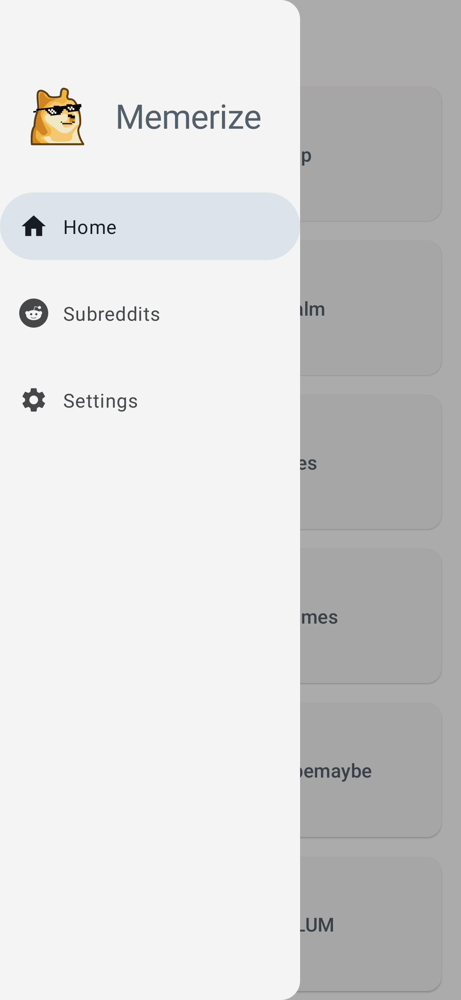
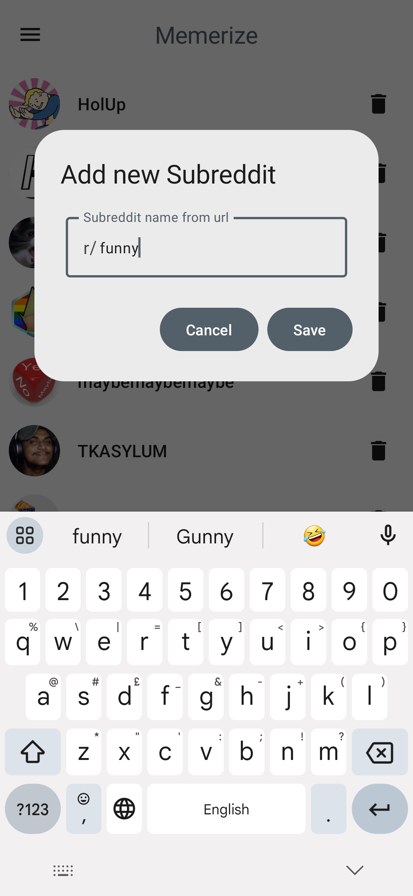
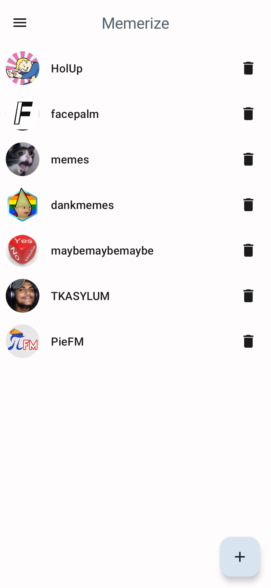
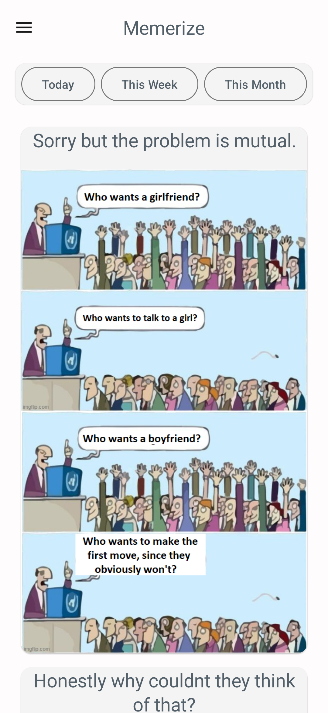

  
  <h1 align="center">Memerize</h1>
  <b>Memerize</b>はRedditとLemmy用の便利なミーム閲覧アプリです

 

    
    
    
    
    
     

---

  
  スクリーンショット

  
  
  

  
  

## 特徴
- ダークモードをサポートしたMaterial you dynamic theme
- Subredditsやlemmyコミュニティを自由に追加/削除できます
- オフライン閲覧のためのミームキャッチをサポート。
- 人気のミームを期間ごとに並べ替えます（今日、今週、今月）
- アプリからのミームの共有をサポート
- ダウンロード場所のカスタマイズが可能

## インストール

## 役立つリンク

